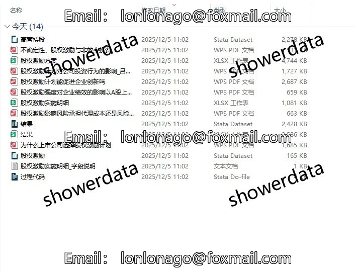
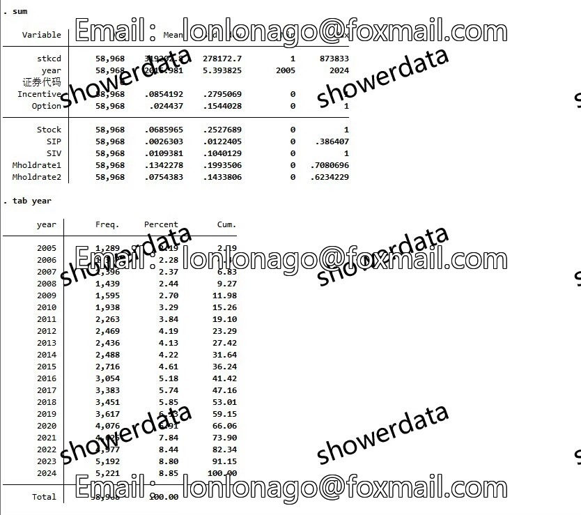
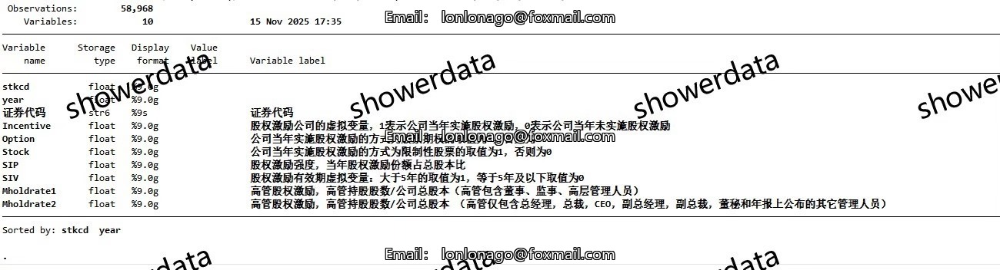
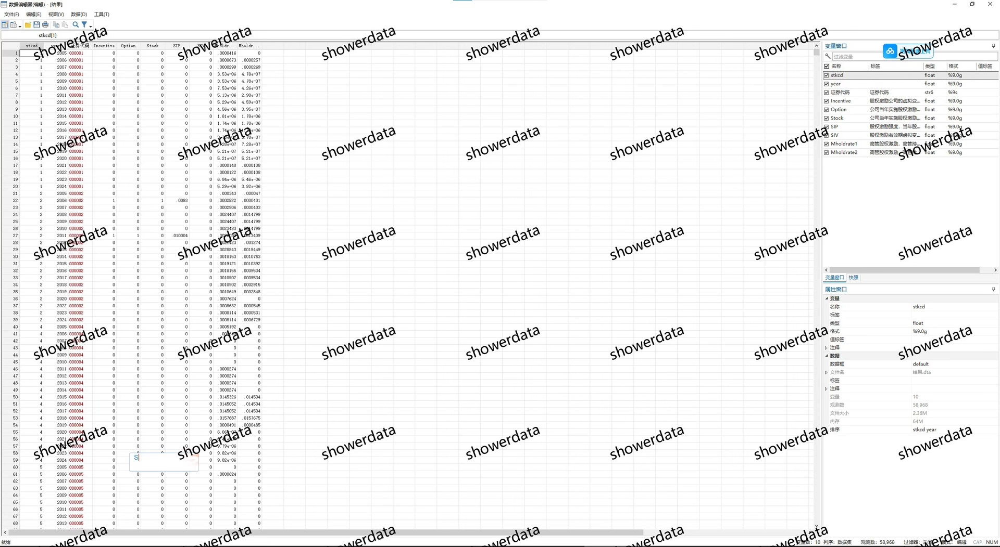
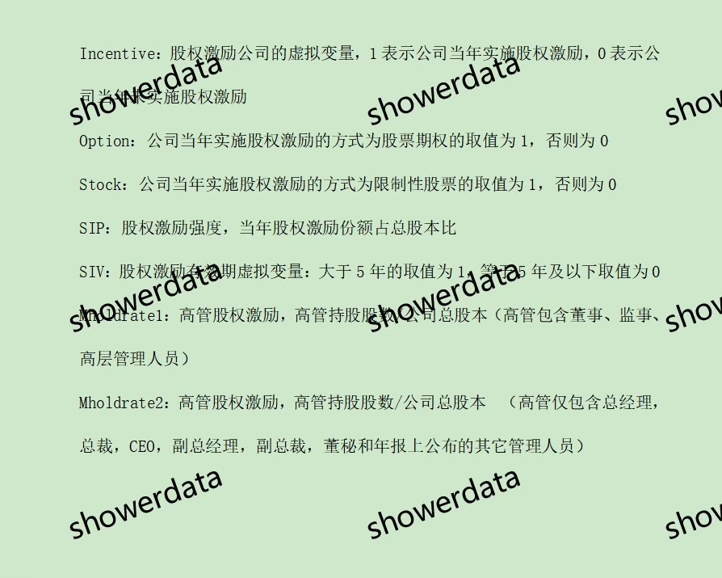
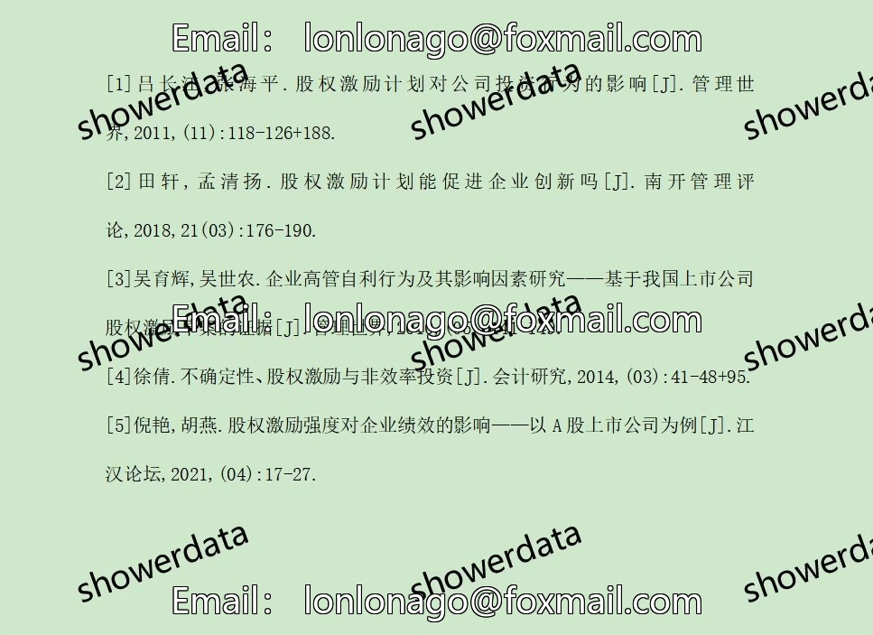

## Body

# 上市公司股权激励指标合集、是否实施股权激励/激励强度/激励方式

## 一、数据介绍

### 数据名称：上市公司股权激励指标合集、是否实施股权激励/激励强度/激励方式

### 样本范围：A鼓尚视公司, 5.8w+条观测值（未剔除已缩尾）

### 时间范围：2005-2024年

### 数据格式：dta、excel

### 数据内容：dta与excel结果、原始数据、代码、参考文献

## 二、数据结果指标如图所示

## 三、计算方法如图所示

## 四、参考文献如图所示

## Images

item_999083267542

Here is a pay link on Stripe ( https://buy.stripe.com/3cs8yP7sY87d0vu9AB ). Please contact me lonlonago@foxmail.com after funding $89, and I will send you a complete data files , thank you!

